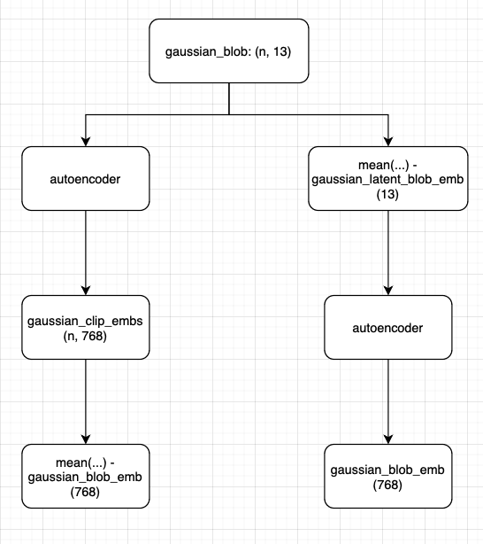
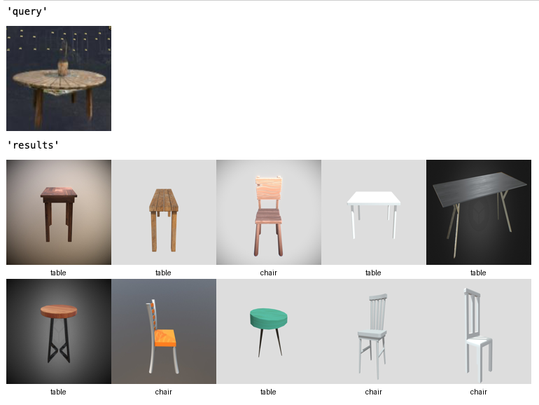
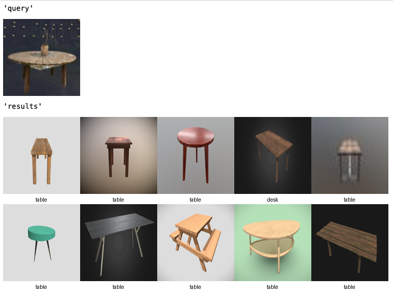

# Week 6: experiments with embeddings
## Feature Splatting CLIP experiment
1. [Used downloaded Objaverse subset](week5.md)
2. Computed average CLIP embeddings of 12 views of ~787 meshes
3. Computed CLIP embeddings of each their class
4. Calculated [{Precision, Recall, F1-Score}@K](../../resources/weekly/week6/metrics_at_k.csv) for each and made sure
averaging embeddings provides enough info for the CLIP search.

## GS blob embedding experiment
Two ways to embed GS blob features:

First (worse):

Second (better):

**Conclusion:** it's enough and better to use averaging in hidden space of CLIP features to get an embedding of a GS blob.
There are 2 reasons to do so:
1. **Better quality:** we can see it in the example and it also could be theoretically explained on how latent space
averages are better for embeddings.
2. **Computational complexity:** there is little overhead to average in latent_dim = 13 and then just add one more vector
to be upscaled by the autoencoder to CLIP dim.

## Possible options/ideas
1. Find scenes with some of those furniture and try out the Gaussian Embeddings
   (possible problem: there are too many Gaussians and the average embedding might not work).
   - If average Gaussian won't work, try out some methods on reducing their number somehow (heuristics or learning based).
2. Find a way on how to get meshes from Gaussian Splats and make meshes from some scenes, then look at the quality of
@1 metrics for the retrieval.
3. Record some scenes with the same classes, mesh objects and do the p.2.
4. Use Depth-Anything for the correct resizing/alignment of a mesh with a GS blob.

# Questions
1. Clarify if we got different embeddings w.r.t view direction
2. Make a diagram for the previous question
3. Try to deconstruct certain meshes to then be able to adapt them to what we had?