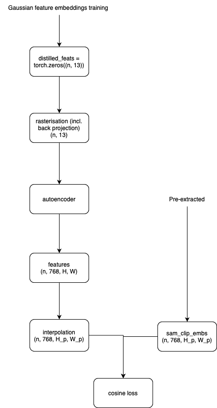

# Week 7: architecture and mesh addition code
1. **Gaussian feature embeddings:** they are rendered in a view-independent manner. It means that
the initial set of gaussian features in dim=13 is stored in the model itself.

**Spotted problems:**
- No actual autoencoder is trained since it's merely upscaling to the bigger dimensions. I.e. scene's gaussions won't
know anything about the CLIP latent space except for the local subspace near the object's center. That's why averaging
should work in principle but no proof it will be good enough.
